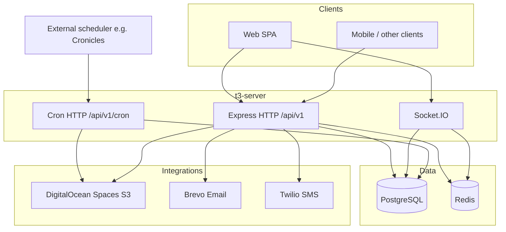
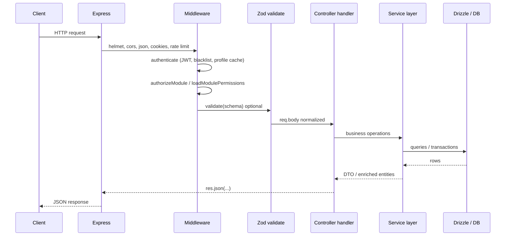
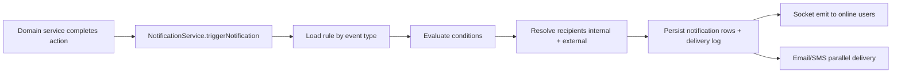

# T3 Server — Backend Architecture & Operations Guide

This document describes the **t3-server** backend as implemented in this repository: technology choices, layered architecture, request and background workflows, major business domains, integrations, and conventions used in day-to-day development.

It is intended for onboarding, system design discussions, and alignment between frontend, backend, and DevOps.

---

## 1. What This Backend Is

**t3-server** is a **Node.js REST API** (versioned under `/api/v1`) for an operations-style product: **bids**, **jobs**, **clients**, **properties**, **fleet**, **dispatch**, **timesheets**, **expenses**, **payroll**, **inventory**, **compliance**, **invoicing**, **notifications**, **reports**, and related **auth / roles / permissions**.

The server also exposes:

- **WebSocket** real-time updates (Socket.IO), notably for notifications.
- **Scheduled-style HTTP endpoints** under `/api/v1/cron/*`, protected by a shared secret, for external schedulers (e.g. Cronicles).
- A lightweight **`/health`** probe for process managers and load balancers.

The API is **not** a static site server for the SPA; CORS is configured for a separate client origin (e.g. `localhost:3000` or `CLIENT_URL`).

---

## 2. Technology Stack

| Area | Technology | Role in this project |
|------|------------|----------------------|
| Runtime | **Node.js** (ESM: `"type": "module"`) | Server execution |
| Language | **TypeScript** | Typed source; compiles to `dist/` |
| HTTP framework | **Express 5** | Routing, middleware pipeline |
| Validation | **Zod** | Request body/query/params schemas (`src/middleware/validate.ts`) |
| ORM / SQL | **Drizzle ORM** + **pg** (`node-postgres`) | Schema-as-code, queries, migrations workflow |
| Database | **PostgreSQL** | Primary data store (`DATABASE_URL`) |
| Cache / ephemeral state | **Redis** (`ioredis`) | Required at startup for 2FA, password reset, email-change flows, token/session-style data |
| Auth tokens | **jsonwebtoken** | Access token verification |
| Password hashing | **bcrypt** / **bcryptjs** | Credential security |
| 2FA | **otplib** | TOTP flows |
| Security middleware | **helmet**, **cors**, **express-rate-limit** | Headers, cross-origin rules, brute-force mitigation on sensitive routes |
| Cookies | **cookie-parser** | HttpOnly cookies where used |
| Real-time | **Socket.IO** | Push notifications to connected clients |
| Object storage | **AWS SDK v3** (`@aws-sdk/client-s3`, presigner) | **DigitalOcean Spaces** (S3-compatible) for uploads and CDN-style URLs |
| Email | **@getbrevo/brevo** | Transactional email |
| SMS | **twilio** | SMS delivery for notifications |
| PDF / HTML rendering | **Puppeteer** | Server-side PDF generation (quotes, invoices, reports) |
| File uploads (HTTP) | **multer**, **multer-s3** | Multipart handling and direct-to-Space uploads where configured |
| Utilities | **date-fns**, **date-fns-tz**, **uuid** | Dates, time zones, identifiers |

**Build & tooling**

- **tsc** — TypeScript compile to `dist/`.
- **tsx** — Run TypeScript in dev and scripts.
- **nodemon** — Dev reload (`pnpm dev` / npm equivalent).
- **eslint** — Linting.
- **drizzle-kit** — Migration generation/studio (project policy: run only when explicitly requested).

---

## 3. High-Level System Architecture

External actors and systems interact with the API, database, Redis, Spaces, and third-party messaging services.

---

## 4. Application Boot Sequence

1. **`src/server.ts`** loads environment (`dotenv`), validates **`DATABASE_URL`** and **`REDIS_URL`** (Redis is mandatory for several auth flows).
2. **`initDB()`** (`src/config/db.ts`) verifies connectivity and prepares the shared **`pg` Pool** and Drizzle **`db`** instance.
3. **`http.createServer(app)`** wraps the Express app from **`src/app.ts`**.
4. **`setupSocketIO(server)`** attaches Socket.IO with CORS aligned to the HTTP API.
5. Server listens on **`PORT`** (default **4000**).
6. **Graceful shutdown** on `SIGINT`/`SIGTERM`: stops HTTP server, ends DB pool, quits Redis.

---

## 5. HTTP Application Layer (`src/app.ts`)

Order matters for security and correctness:

1. **`trust proxy`** — First proxy trusted (for correct `req.ip` behind Traefik/EasyPanel-style proxies).
2. **helmet** — Security headers; strict CSP suitable for an API-only server; HSTS in production.
3. **cors** — Allowed origins include `localhost:3000`, `CLIENT_URL`, optional legacy URL.
4. **express.json** / **urlencoded** — Body parsing with size limits (**100kb**).
5. **cookie-parser** — Cookie access.
6. **globalLimiter** — Baseline rate limiting.
7. **Static `/assets`** — Serves template assets (e.g. email images) from `src/templates/assets`.
8. **`/health`** — Fast liveness JSON (no DB/Redis checks by design).
9. **`/api/v1`** — Main router (`src/routes/index.ts`).
10. **errorHandler** — Centralized errors, including parsed DB errors in development.

---

## 6. Routing Map (`/api/v1`)

The root router mounts domain routers. Representative structure:

| Mount path | Purpose |
|------------|---------|
| `/config` | Public configuration for client bootstrap |
| `/cron` | Secret-protected maintenance and notification batch jobs |
| `/auth` | Login, 2FA, password reset, session/me, user profile routes |
| `/auth/user` | UI permissions |
| `/auth/settings` | User-facing settings |
| `/org` | Majority of business modules: departments, positions, employees, expenses, timesheets, financials, bids, jobs, clients, properties, payroll, compensation, capacity, inventory, compliance, fleet, dispatch, invoices, reviews, dashboard, notifications, reports, search |
| `/org/files` | Files v2 (uploads, presigns, lifecycle) |
| `/org/payroll`, `/org/compensation`, `/org/capacity`, `/org/inventory`, `/org/compliance`, `/org/fleet`, `/org/dispatch` | Namespaced org modules |

**Authentication** is applied per-router (not globally): public routes (login, config) stay open; org routes typically chain **`authenticate`** then **`authorizeModule`** / **`loadModulePermissions`** for feature-based access.

---

## 7. Request Lifecycle (Conceptual Workflow)

**Typical responsibilities**

- **Routes** — Wire HTTP method + path to handler; stack middleware in the right order.
- **Middleware** — Auth, permissions, validation, optional response shaping.
- **Controllers** — Parse `req`, call services, map HTTP status codes, avoid embedding heavy SQL.
- **Services** — Business rules, orchestration, transactions, cross-entity updates, notification triggers.
- **Repositories** — Some domains (e.g. notifications) use dedicated repository classes; others query Drizzle directly in services (both patterns exist).
- **Drizzle schema** — Single source of truth for tables, enums, indexes (plus SQL migrations in `src/drizzle/migrations/`).

---

## 8. Authentication & Authorization

### 8.1 Authentication

- **JWT**-based access; tokens verified in **`authenticate`** (`src/middleware/auth.ts`).
- **Token blacklist** check for revoked tokens (`src/utils/tokenBlacklist.js` usage from middleware).
- **LRU + TTL cache** of authenticated principal data to reduce repeated DB hits on hot paths.
- **Timeouts** around DB lookups in auth to avoid hanging requests.
- **`GET /auth/me`**-style profile bundle is resolved in **`auth.service`** and can be attached to `req` to avoid duplicate queries.

### 8.2 Two-factor, password reset, email change

- **Redis** is required at process start; used for OTPs, verification steps, and related ephemeral state (see `server.ts` comments).

### 8.3 Authorization (feature-based)

- **`featurePermission.service`** resolves the user’s **role**, optional **employee** context (department, position), and maps **features** and **UI elements** from `auth.features`, `auth.role_features`, etc. (`src/drizzle/schema/features.schema.ts`).
- Route groups call **`authorizeModule("bids")`** (and similar) and **`loadModulePermissions`** so handlers can enforce **view / create / update / delete** style access and **data filters** (e.g. assigned-only visibility for technicians).
- **UI permissions** routes expose what the SPA should show or hide.

### 8.4 Rate limiting

Dedicated limiters on high-risk endpoints (login, 2FA verify, password reset, resend OTP) in `src/middleware/rateLimiter.js`.

---

## 9. Domain Model & Business Logic (Major Modules)

The product models **field service / construction-style operations**: selling work (bids), executing work (jobs), staffing (employees, timesheets, payroll), assets (fleet), scheduling (dispatch, capacity), money (financials, expenses, invoicing), and governance (compliance, reviews).

### 9.1 Clients, properties, and “organization” semantics

- The codebase distinguishes **authenticated users** (`req.user.id`) from **client organizations** stored as **`organizationId`** on entities such as **bids** and **jobs**.
- **Bids** are created **for** a client **`organizationId`** **by** internal users; default **status** may depend on **role** (e.g. Executive vs Manager) in `BidController`.
- Access control for org routes is primarily **user + role + feature permissions**, not “assume this JWT org is the data tenant” for all modules—always read the code path for the specific resource.

### 9.2 Bids

- Rich bid entities with nested structures (financial breakdown, materials, labor, survey/plan/spec data, etc.) orchestrated in **`bid.service`** and **`BidController`**.
- **Cron**: **`/api/v1/cron/expire-bids`** calls **`expireExpiredBids`** to move stale bids based on business dates.

### 9.3 Jobs

- Work execution tied to bid/client context; **`job.service`** / **`JobController`** coordinate lifecycle, assignments, and related rules (see validations and schema in `jobs.schema.ts`).

### 9.4 Timesheets, expenses, payroll, compensation

- **Timesheets** — clock in/out, approvals, org policies; integrates with notifications (e.g. reminders).
- **Expenses** — submissions, approvals, analytics services.
- **Payroll / compensation** — payroll schema and dedicated routes.

### 9.5 Fleet, dispatch, capacity

- **Fleet** — vehicles, maintenance, registration/insurance dates; cron-driven reminders (see `cronRoutes` + `notifications-cron.service`).
- **Dispatch** — operational dispatch schema and service.
- **Capacity** — planning / utilization style APIs.

### 9.6 Inventory

- Modular inventory services under **`src/services/inventory/`** (master data, purchase orders, allocations, reports) with **`InventoryController`**.

### 9.7 Compliance

- Compliance enums/schema and validations; org routes under **`/org/compliance`**.

### 9.8 Invoicing & PDFs

- **`invoicing.service`** generates invoice lifecycle data.
- **`pdf.service`** uses **Puppeteer** to render HTML templates (e.g. `src/templates/invoice-template.html`, `quote-template.html`) into PDFs for download or email attachment flows.

### 9.9 Financials & reports

- **`financial.service`**, **`reports.service`**, and related controllers expose reporting and financial operations; templates exist for expense/financial reports.

### 9.10 Files (v2)

- **`files-v2.service`** and **`FilesV2Controller`** — uploads, metadata, soft delete, purge.
- **Cron**: purge soft-deleted files from Spaces after retention, then hard-delete DB rows.

### 9.11 Dashboard & search

- Aggregated dashboard endpoints and org-wide search (`searchRoutes`).

---

## 10. Data Layer

### 10.1 Drizzle + PostgreSQL

- **`src/config/db.ts`** creates a **`Pool`** and **`drizzle(pool)`** instance exported as **`db`**.
- **Type parsers** — `TIMESTAMP`, `DATE`, and **`TIMESTAMPTZ`** are intentionally returned as **strings** to avoid implicit local-timezone shifts in Node’s default `pg` parsing.

### 10.2 Schema layout (`src/drizzle/schema/`)

Illustrative modules (file names):

- **`auth.schema.ts`** — users, roles, sessions-related tables.
- **`org.schema.ts`** — employees, departments, positions, org structure.
- **`client.schema.ts`**, **`property`**-related tables.
- **`bids.schema.ts`**, **`jobs.schema.ts`** — sales and delivery pipeline.
- **`timesheet.schema.ts`**, **`expenses.schema.ts`**, **`payroll.schema.ts`**, **`financial.schema.ts`**.
- **`fleet.schema.ts`**, **`dispatch.schema.ts`**, **`capacity.schema.ts`**.
- **`inventory.schema.ts`**, **`compliance.schema.ts`**.
- **`invoicing.schema.ts`**.
- **`notifications.schema.ts`** — notifications, rules, preferences, delivery logs.
- **`settings.schema.ts`**, **`features.schema.ts`** — app settings and permission catalog.

### 10.3 Migrations

- SQL migrations and Drizzle meta snapshots live under **`src/drizzle/migrations/`**.
- **Project policy**: migration **generation** and **`db:migrate`** runs are **operator-driven** (not automated by agents) unless explicitly requested.

---

## 11. Notifications Architecture

### 11.1 Concepts

- **Event types** — e.g. job overdue, invoice due, fleet maintenance, safety inspections, purchase order delays (see `notifications-cron.service` imports from `cronRoutes`).
- **Rules** — DB-backed rules (`notificationRules` seed) determine **enabled/disabled**, **conditions** (JSON evaluated in **`notification-helpers`**), and **recipient resolution**.
- **Channels** — in-app (DB + Socket), **email** (**`NotificationEmailService`** / Brevo), **SMS** (**`NotificationSMSService`** / Twilio).
- **Mandatory rules** — some events are protected from misconfiguration (`mandatory-notification-rules`).

### 11.2 Delivery path

### 11.3 Queue

- **`src/queues/notification.queue.ts`** is a **stub**: Bull/Redis queue was removed; delivery runs **inline** with **`Promise.allSettled`** style parallelism inside the notification service (see file header comments).

### 11.4 Cron-driven notifications

- **`/api/v1/cron/*`** endpoints (with **`CRON_SECRET`**) call **`notifications-cron.service`** functions: invoices (due tomorrow, overdue tiers), jobs overdue, clock reminders, fleet maintenance and registration/insurance expirations, safety inspections, performance reviews, PO delays, etc.
- Responses are often **202 Accepted** with **background execution**; operators rely on **logs** for outcomes (`scheduleCronJob` pattern in `cronRoutes.ts`).

---

## 12. Real-Time (Socket.IO)

- **`src/config/socket.ts`** initializes Socket.IO on the same HTTP server.
- **Auth** mirrors REST: token from handshake **`auth`**, **`query.token`**, or headers (**Bearer**, **`token`**, **`x-auth-token`**).
- After JWT verification, loads user via **`getUserByIdForAuth`** and checks **active / not deleted**.
- Emits structured **notification events** (`SOCKET_EVENTS` in `notification.types.ts`) to user-specific rooms.

**Scaling note (in-code comment):** current deployment assumes **single-server** Socket.IO (no Redis adapter). Horizontal scaling would require an adapter and sticky sessions or equivalent.

---

## 13. File Storage (DigitalOcean Spaces)

- **`storage.service.ts`** configures **`S3Client`** against **Spaces endpoint/region/keys**.
- Supports **upload**, **delete**, **presigned upload URLs**, and **`resolveStorageUrl`** to turn keys into CDN or direct Space URLs.
- **Upload timeout** configurable via env.

---

## 14. Email & SMS

- **Brevo** SDK for transactional email (`email.service` / `notification-email.service`).
- **Twilio** for SMS (`notification-sms.service`).
- Templates and static inline images may be served from **`/assets`** as configured in `app.ts`.

---

## 15. Cross-Cutting Utilities & Patterns

| Concern | Implementation idea |
|---------|---------------------|
| Optimistic concurrency | **`optimistic-lock`** utilities (e.g. stale data responses) |
| DB error UX | **`database-error-parser`** + `errorHandler` returns friendly messages / codes |
| Time zones | **`timezone`** helpers, **date-fns-tz** |
| Logging | **`utils/logger`** with structured API error logging |
| Response shaping | **`response-transformer`** middleware in some routes |
| Caching | Org aggregate cache (**`org-aggregate-cache`**), auth LRU, role context TTL map |
| Sequences / Postgres | **`try-setval-in-transaction`** for safe sequence alignment in migrations/data fixes |

### 15.1 API response conventions

Handlers typically return JSON with **`success`**, **`message`**, and payload fields. Enriched records often include human-readable **`*Name`** fields for user/employee foreign keys (workspace standard documented in `.cursor/rules/user-fk-names.mdc`).

### 15.2 Validation

Zod schemas in **`src/validations/*`** validate composite objects `{ body, query, params }`; **`validate`** middleware writes back **`req.body`** when the schema outputs a `body` field.

---

## 16. Security Summary

- **Helmet** + strict CSP for API-only hosting.
- **CORS** allowlist with credentials support.
- **Rate limits** on authentication and sensitive flows.
- **Cron** endpoints require **`CRON_SECRET`** via **`X-Cron-Secret`** or **`Authorization: Bearer`** (query-string secrets intentionally not supported).
- **JWT** verification + **blacklist** + inactive/deleted user checks (HTTP and Socket).
- **Secrets** only via environment variables; **Redis** and **DB** required for full feature parity.

---

## 17. Build, Run, and Operations

### 17.1 Scripts (from `package.json`)

| Script | Purpose |
|--------|---------|
| `build` | `tsc` + copy HTML templates to `dist` |
| `dev` | `nodemon` development |
| `start` | Run compiled `dist/server.js` |
| `start:dev` | `tsx` with `.env` for quick local runs |
| `lint` / `lint:fix` | ESLint |
| `seed` / `seed:*` | Database seed utilities |
| `db:generate`, `db:migrate`, `db:studio`, `db:push` | Drizzle tooling (**run only when explicitly approved**) |
| `health-check` | Standalone health script |

### 17.2 Environment variables (non-exhaustive)

| Variable | Role |
|----------|------|
| `DATABASE_URL` | PostgreSQL connection (**required**) |
| `REDIS_URL` | Redis (**required** at startup) |
| `PORT` | HTTP port (default 4000) |
| `CLIENT_URL`, `CLIENT_URL_Old` | CORS + Socket origins |
| `NODE_ENV` | Production vs development behavior (HSTS, error detail) |
| `CRON_SECRET` | Protects `/api/v1/cron/*` |
| `DO_SPACES_*` | Spaces / S3 uploads |
| Email/SMS keys | Brevo / Twilio as configured in services |
| `SOCKET_IO_*` | Ping tuning |

---

## 18. Ideas & Principles Embodied in the Codebase

1. **Feature-first authorization** — Fine-grained modules (bids, jobs, fleet, …) rather than only coarse roles.
2. **Rule-driven notifications** — Operators can tune events and channels without redeploying all business logic (within the constraints of seeded rules and code-supported event types).
3. **Explicit timezone safety** — DB timestamps handled carefully to avoid silent JS `Date` shifts.
4. **Operational hooks over in-process schedulers** — Cron is HTTP-driven from an external scheduler, which simplifies deployment in container platforms.
5. **Direct notification delivery** — Removed Bull queue complexity; trade-off is less backpressure isolation at extreme scale.
6. **Monolith-friendly modular services** — Clear domain folders (`services`, `controllers`, `routes`, `validations`) over microservices for this stage of the product.

---

## 19. How to Read the Codebase Next

1. Start at **`src/server.ts`** → **`src/app.ts`** → **`src/routes/index.ts`**.
2. Pick a domain (e.g. bids): **`bidRoutes.ts`** → **`BidController.ts`** → **`bid.service.ts`** → **`bids.schema.ts`**.
3. For permissions: **`featurePermission.service.ts`** + **`middleware/auth.ts`**.
4. For background behavior: **`cronRoutes.ts`** + **`notifications-cron.service.ts`**.
5. For real-time UX: **`config/socket.ts`** + **`notification.service.ts`**.

---

## 20. Document Maintenance

This file is a **snapshot of architecture** derived from the repository layout and key source files. When you add a new domain router, integration, or change notification delivery, update the relevant sections here so onboarding stays accurate.

---

*Generated for the **t3-server** repository. For migration execution policy and Drizzle commands, follow `.cursor/rules/drizzle-commands.mdc` and internal runbooks.*
