# Bids Schema ER Diagram

This ER diagram represents the database schema for the **Bids** module only, extracted from `bids.schema.ts`.

## Schema Overview

The Bids schema consists of **15 tables** centered around the main `org_bids` table:

### Core Tables

1. **org_bids** - Main bids table (central entity)
2. **org_bid_financial_breakdown** - One-to-one financial summary
3. **org_bid_operating_expenses** - One-to-one operating expenses calculation
4. **org_bid_survey_data** - One-to-one survey data (for survey-type bids)
5. **org_bid_plan_spec_data** - One-to-one plan spec data (for plan-spec bids)
6. **org_bid_design_build_data** - One-to-one design build data (for design-build bids)

### Related Tables (One-to-Many)

7. **org_bid_materials** - Materials list for each bid
8. **org_bid_labor** - Labor entries for each bid
9. **org_bid_travel** - Travel expenses for each bid
10. **org_bid_timeline** - Timeline events and milestones
11. **org_bid_documents** - General documents
12. **org_bid_plan_spec_files** - Plan/spec specific files
13. **org_bid_design_build_files** - Design-build specific files
14. **org_bid_notes** - Comments and notes
15. **org_bid_history** - Audit trail for changes

## Relationship Types

- **One-to-One (||--||)**: Financial breakdown, operating expenses, survey data, plan spec data, design build data
- **One-to-Many (||--o{)**: Materials, labor, travel, timeline, documents, files, notes, history

## External Dependencies

- **org_organizations** - All bid tables reference an organization
- **auth_users** - Many bid tables reference users (created_by, assigned_to, etc.)
- **org_jobs** - Bids can be converted to jobs

## How to View

### Option 1: Online Mermaid Editor (Recommended)
1. Go to https://mermaid.live/
2. Copy the contents of `bids-erd.mmd`
3. Paste and view the interactive diagram

### Option 2: VS Code Extension
Install the "Markdown Preview Mermaid Support" extension in VS Code to view the diagram.

### Option 3: GitHub/GitLab
If you push this to GitHub or GitLab, the Mermaid diagram will render automatically in the markdown file.

## Mermaid Diagram

```mermaid
erDiagram
    org_bids {
        uuid id PK
        varchar bid_number UK
        varchar title
        enum job_type
        enum status
        enum priority
        uuid organization_id FK
        varchar project_name
        text site_address
        date start_date
        date end_date
        numeric bid_amount
        uuid created_by FK
        uuid assigned_to FK
        uuid job_id FK
        boolean is_deleted
        timestamp created_at
    }
    
    org_bid_financial_breakdown {
        uuid id PK
        uuid organization_id FK
        uuid bid_id FK,UK
        numeric materials_equipment
        numeric labor
        numeric travel
        numeric operating_expenses
        numeric total_cost
    }
    
    org_bid_materials {
        uuid id PK
        uuid organization_id FK
        uuid bid_id FK
        text description
        numeric quantity
        numeric unit_cost
        numeric total_cost
    }
    
    org_bid_labor {
        uuid id PK
        uuid organization_id FK
        uuid bid_id FK
        varchar role
        integer quantity
        integer days
        numeric cost_rate
        numeric total_cost
    }
    
    org_bid_travel {
        uuid id PK
        uuid organization_id FK
        uuid bid_id FK
        varchar employee_name
        numeric round_trip_miles
        numeric mileage_rate
        numeric total_cost
    }
    
    org_bid_operating_expenses {
        uuid id PK
        uuid organization_id FK
        uuid bid_id FK,UK
        boolean enabled
        numeric calculated_operating_cost
        numeric operating_price
    }
    
    org_bid_survey_data {
        uuid id PK
        uuid organization_id FK
        uuid bid_id FK,UK
        varchar building_number
        text site_location
        varchar work_type
        uuid technician_id FK
    }
    
    org_bid_plan_spec_data {
        uuid id PK
        uuid organization_id FK
        uuid bid_id FK,UK
        text specifications
        text design_requirements
    }
    
    org_bid_design_build_data {
        uuid id PK
        uuid organization_id FK
        uuid bid_id FK,UK
        text design_requirements
        text build_specifications
    }
    
    org_bid_timeline {
        uuid id PK
        uuid organization_id FK
        uuid bid_id FK
        varchar event
        timestamp event_date
        enum status
        uuid created_by FK
    }
    
    org_bid_documents {
        uuid id PK
        uuid organization_id FK
        uuid bid_id FK
        varchar file_name
        varchar file_path
        varchar document_type
        uuid uploaded_by FK
    }
    
    org_bid_plan_spec_files {
        uuid id PK
        uuid organization_id FK
        uuid bid_id FK
        varchar file_type
        varchar file_name
        varchar file_path
        uuid uploaded_by FK
    }
    
    org_bid_design_build_files {
        uuid id PK
        uuid organization_id FK
        uuid bid_id FK
        varchar file_name
        varchar file_path
        uuid uploaded_by FK
    }
    
    org_bid_notes {
        uuid id PK
        uuid organization_id FK
        uuid bid_id FK
        text note
        uuid created_by FK
        boolean is_internal
    }
    
    org_bid_history {
        uuid id PK
        uuid organization_id FK
        uuid bid_id FK
        varchar action
        text old_value
        text new_value
        uuid performed_by FK
    }
    
    auth_users {
        uuid id PK
    }
    
    org_organizations {
        uuid id PK
    }
    
    org_jobs {
        uuid id PK
    }
    
    %% Relationships - One-to-One
    org_bids ||--|| org_bid_financial_breakdown : "has"
    org_bids ||--o| org_bid_operating_expenses : "has"
    org_bids ||--o| org_bid_survey_data : "has"
    org_bids ||--o| org_bid_plan_spec_data : "has"
    org_bids ||--o| org_bid_design_build_data : "has"
    
    %% Relationships - One-to-Many
    org_bids ||--o{ org_bid_materials : "has"
    org_bids ||--o{ org_bid_labor : "has"
    org_bids ||--o{ org_bid_travel : "has"
    org_bids ||--o{ org_bid_timeline : "has"
    org_bids ||--o{ org_bid_documents : "has"
    org_bids ||--o{ org_bid_plan_spec_files : "has"
    org_bids ||--o{ org_bid_design_build_files : "has"
    org_bids ||--o{ org_bid_notes : "has"
    org_bids ||--o{ org_bid_history : "has"
    
    %% External Relationships
    org_organizations ||--o{ org_bids : "receives"
    auth_users ||--o{ org_bids : "creates"
    org_jobs ||--o| org_bids : "converted from"
```

## Legend

- **PK**: Primary Key
- **FK**: Foreign Key
- **UK**: Unique Key
- **||--||**: One-to-One relationship
- **||--o{**: One-to-Many relationship
- **||--o|**: One-to-Zero-or-One relationship (optional one-to-one)

