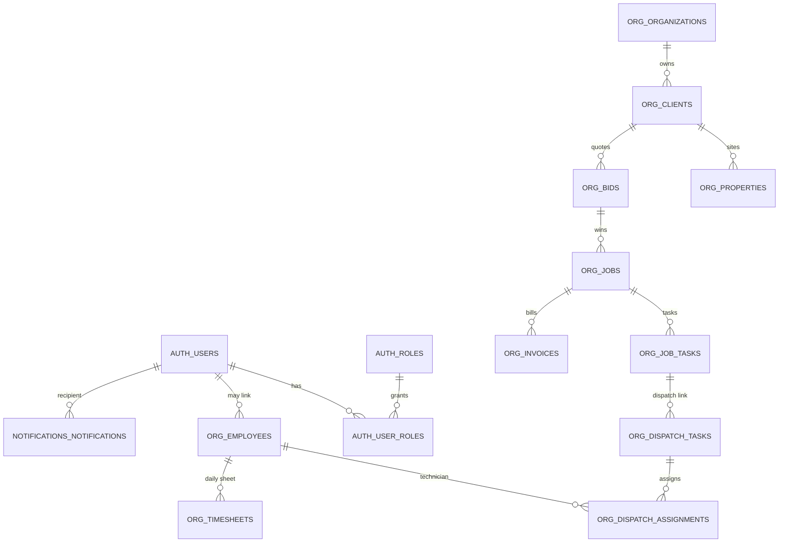

# Database schema and ERD — T3 Server (Drizzle ORM)

PostgreSQL is the system of record. Drizzle models live under `src/drizzle/schema/*.ts`, migrations under `src/drizzle/migrations/`, and config in `drizzle.config.ts` (uses `DATABASE_URL`).

---

## 1. PostgreSQL schemas (namespaces)

Drizzle uses multiple **`pgSchema`** buckets so tables are grouped logically:

| Drizzle schema constant | PostgreSQL schema | Typical contents |
|-------------------------|-------------------|------------------|
| `auth` | `auth` | Users, roles, permissions, RBAC/feature tables, audit logs, trusted devices, settings templates |
| `org` | `org` | Operating data: clients, properties, jobs, bids, dispatch, timesheets, fleet, inventory, payroll, compliance, invoices, expenses, capacity, etc. |
| `notificationSchema` | `notifications` | In-app notifications, preferences, rules, delivery logs, cooldowns |
| `financial` | `financial` | Cross-cutting financial constructs (e.g. category budgets) |

Many “business” tables live in **`org`** even when the UI calls them “auth settings” — check `settings.schema.ts`: some templates use `auth.*` and `org.invoice_settings`.

---

## 2. How to inspect or export an ERD

### Option A — Drizzle Studio (interactive)

```bash
cd C:\Users\ASCE\Desktop\t3-server
npm run db:studio
```

Opens Drizzle Studio against `DATABASE_URL` for browsing tables and relationships.

### Option B — Project ERD script

```bash
npm run db:erd
```

Runs `scripts/generate-erd.ts`, which introspects Drizzle table metadata and generates ERD-oriented output (see script header for output path and format).

### Option C — SQL / pgAdmin

Use `information_schema.tables` / `information_schema.columns` filtered by `table_schema IN ('auth','org','notifications','financial')`.

---

## 3. High-level ERD (conceptual)

The diagram below is **simplified**: many-to-many and satellite tables are collapsed. Use Drizzle files for exact FKs and indexes.



Table names above are illustrative snake_case; Drizzle exports use **camelCase** identifiers mapping to SQL names (e.g. `users` → `auth.users`).

---

## 4. Table catalog by Drizzle source file

### `auth.schema.ts` (`auth` schema)

| Drizzle export | SQL table (typical) | Notes |
|----------------|---------------------|--------|
| `users` | `auth.users` | Login identity, profile fields |
| `roles` | `auth.roles` | Named roles (Executive, Manager, Technician, …) |
| `permissions` | `auth.permissions` | Permission catalog |
| `rolePermissions` | `auth.role_permissions` | Role ↔ permission |
| `userRoles` | `auth.user_roles` | User ↔ role |
| `trustedDevices` | `auth.trusted_devices` | Remember-device tokens |
| `auditLogs` | `auth.audit_logs` | Security / admin audit trail |

### `features.schema.ts` (`auth` schema)

| Drizzle export | Purpose |
|----------------|---------|
| `features` | Feature flags / module features |
| `roleFeatures` | Role ↔ feature access |
| `uiElements` | UI element registry |
| `roleUIElements` | Role ↔ UI visibility |
| `dataFilters` | Row-level / scope filters |
| `fieldPermissions` | Field-level read/write |

### `settings.schema.ts` (`auth` + `org`)

| Drizzle export | Schema | Purpose |
|----------------|--------|---------|
| `generalSettings` | `auth` | Org-wide general settings |
| `laborRateTemplates` | `auth` | Labor rate templates |
| `vehicleTravelDefaults` | `auth` | Vehicle & travel defaults |
| `travelOrigins` | `auth` | Origins for travel calcs |
| `operatingExpenseDefaults` | `auth` | Opex defaults |
| `proposalBasisTemplates` | `auth` | Proposal basis templates |
| `termsConditionsTemplates` | `auth` | T&C templates |
| `invoiceSettings` | `org` | `invoice_settings` — invoice numbering / presentation |

### `org.schema.ts` (`org` schema)

| Drizzle export | Purpose |
|----------------|---------|
| `departments` | Departments |
| `positions` | Job positions / titles |
| `employees` | Employees (links to users, departments, vehicles, etc.) |
| `userBankAccounts` | `user_bank_accounts` |
| `employeeReviews` | `employee_reviews` |
| `revenueTargets` | Dashboard revenue targets / goals |
| `employeeDocuments` | Employee document metadata |

### `client.schema.ts` (`org` schema)

Includes clients, properties, contacts, notes, documents, classifications, and **embedded financial planning tables** used by the Financial module UI:

| Drizzle export | Purpose |
|----------------|---------|
| `clientTypes`, `industryClassifications` | Reference data |
| `organizations` | Tenant / org row (naming: “organizations” in DB) |
| `clientContacts`, `clientNotes`, `clientDocuments` | CRM-style data |
| `documentCategories`, `clientDocumentCategories` | Document taxonomy |
| `properties`, `propertyContacts`, `propertyEquipment`, `propertyDocuments`, `propertyServiceHistory` | Property module |
| `financialSummary`, `financialCostCategories`, `profitTrend`, `cashFlowProjection`, `cashFlowScenarios`, `revenueForecast`, `financialReports` | Financial analytics entities |

### `bids.schema.ts` (`org` schema)

Full bid lifecycle: core `bidsTable`, financial breakdown, materials, labor, travel, operating expenses, survey/plan-spec/design-build/service/PM blobs, timeline, notes, history, documents, media, walk photos, file attachments.

### `jobs.schema.ts` (`org` schema)

| Drizzle export | Purpose |
|----------------|---------|
| `jobs` | Job header / status / links to client, property, bid |
| `jobTeamMembers` | Assigned team |
| `jobNotes`, `jobTasks`, `taskComments` | Collaboration |
| `jobExpenses` | Job-level expenses |
| `jobServiceCalls`, `jobPMInspections`, `jobPlanSpecRecords`, `jobDesignBuildNotes`, `jobSurveys` | Job execution artifacts |
| `jobHistory` | Audit-style history |
| `jobLogs`, `jobLogMedia` | Field logs + media |

**Note:** `job_materials` existed historically; current Drizzle comments indicate **job materials were removed** from ORM in favor of bid-linked data — verify your migrated DB still matches `jobs.schema.ts` and latest SQL migrations.

### `dispatch.schema.ts` (`org` schema)

| Drizzle export | Purpose |
|----------------|---------|
| `dispatchTasks` | Dispatchable units of work |
| `dispatchAssignments` | Technician assignments, time in/out, logged hours |

### `timesheet.schema.ts` (`org` schema)

| Drizzle export | SQL / purpose |
|----------------|---------------|
| `timesheets` | `org.timesheets` — one row per employee per **day**; totals fed from dispatch |
| `timesheetEntries` | **Alias** of `timesheets` (reports compatibility) |
| `timesheetJobEntries` | `timesheet_job_entries` — manual / coverage blocks |
| `timesheetApprovals` | Approval workflow rows |

### `fleet.schema.ts` (`org` schema)

Vehicles, maintenance, repairs, inspections (+ line items), fuel, check-in/out, assignment history, media, documents, metrics, vehicle history.

### `inventory.schema.ts` (`org` schema)

Categories, suppliers, locations, units, items, stock locations, transactions, purchase orders + line items, allocations, alerts, item history, price history, physical counts + count lines. Uses PostgreSQL **enums** for stock status, allocation status, transaction types, PO status.

### `invoicing.schema.ts` (`org` schema)

Invoices, line items, payments, documents, history, reminders, credit notes, credit note applications.

### `expenses.schema.ts` (`org` schema)

Expenses, reports, line items, receipts, approvals, allocations, mileage, reimbursements, budgets, history.

### `payroll.schema.ts` (`org` schema)

Pay periods, compensation, payroll runs & entries, timesheet integration logs, approval workflow, locks, deductions, benefits, leave balances, audit log, tax tables.

### `compliance.schema.ts` (`org` schema)

Compliance cases, certifications, violation history, training programs, training records, compliance audit log.

### `capacity.schema.ts` (`org` schema)

Shifts, availability, resource allocations, department capacity metrics, utilization history, capacity planning templates.

### `notifications.schema.ts` (`notifications` schema)

| Drizzle export | Purpose |
|----------------|---------|
| `notifications` | User notifications |
| `notificationPreferences` | Per-user preferences |
| `notificationRules` | Rule engine definitions |
| `notificationDeliveryLog` | Delivery audit |
| `notificationCooldowns` | Anti-spam / throttle state |

### `financial.schema.ts` (`financial` schema)

| Drizzle export | Purpose |
|----------------|---------|
| `financialCategoryBudgets` | Category-level budgets |

---

## 5. Migrations workflow

| Command | Purpose |
|---------|---------|
| `npm run db:generate` | Generate SQL from schema drift (Drizzle Kit). |
| `npm run db:migrate` | Apply pending migrations. |
| `npm run db:push` | Push schema directly (dev only — avoid in prod unless intended). |
| `npm run db:verify` | Verify migration state (`scripts/verify-migration.ts`). |

---

## 6. Indexing and constraints

- Drizzle table builders in each `*.schema.ts` file define **`index()`** and **`unique()`** where needed (example: `timesheets` has `unique_employee_day` on `(employeeId, sheetDate)`).
- Foreign keys use `.references(() => ...)` with `onDelete` policies per column.

---

## 7. Relationship to the API

- **Controllers → services → repositories** load and persist these tables.
- **Zod** validations in `src/validations/*.ts` mirror API shapes; they are not the DB DDL but should stay aligned with Drizzle types.

For HTTP surface area, see **`api-reference.md`** in this folder.
